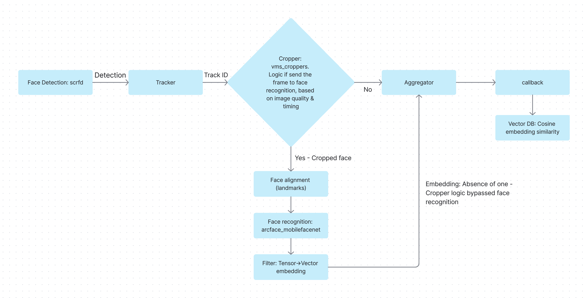

# Magic Mirror System

> ⚠️ **Beta:** This application is currently in beta. Features and APIs may change.

## Quick Start:

This uses the sample training dataset and sample video for demonstration purposes:
```
python magic_mirror.py --mode train
python magic_mirror.py
```

## Documentation

This project is a face recognition system built using:

1. Python - Application code (image post-processing in C++)
2. GStreamer - Real-time video processing pipeline
3. LanceDB - Embeddings database (stored in a file)
4. FiftyOne - Dataset inspection and analysis

This project is moderately advanced and is recommended for use after gaining some experience with the "Basic Pipelines."

The system supports real-time face recognition using GStreamer pipelines and the Hailo neural network AI accelerator.

Magic Mirror also runs pose estimation in run mode to recognize basic gestures. The initial supported gestures are `swipe_left` and `swipe_right`; when detected, they are printed and sent through the configured notification handlers.

It can train the known persons' catalog *from a provided directory with images of persons* (train mode below).

The information is managed in a local ("on a file") database optimized for storing and indexing AI embeddings, called LanceDB. This is a significant improvement over the commonly used static string-based files, such as JSON.

The system provides an optional web interface, powered by the well-known FiftyOne platform (Python package installation required), for managing face recognition data, including visualizing embeddings and adding, updating, or deleting persons and their associated images. The web interface runs on localhost and interacts with the local LanceDB database.

In addition, the db_handler.py module provides a custom API for interactions with the LanceDB database for fine-grained DB management.

For demonstration purposes, the current application demonstrates sending Telegram or Discord notifications via a bot when a person (either recognized or unknown) is detected. To enable Telegram, the Telebot package is required but not installed by default, so you need to install it separately. Discord notifications use the Discord Bot API and require a bot token and channel ID. In their absence, the function will simply do nothing. Please refer to Telegram or Discord guides on how to set up a bot.

For each face detection, there is a confidence level, followed by another confidence level for the recognition itself - in case the face was recognized as someone from the database.

Face recognition confidence is per person record in the database, initiated with a default value (0.3) and can be manually modified either via the FiftyOne web interface or the db_handler.py API.

### Algorithmic configuration parameters:

For best performance, there is a quality selection mechanism on what frames are good enough to be evaluated and searched for face classification. The parameters are read from:

[face_recon_algo_params.json](face_recon_algo_params.json)

In other words - each frame should pass those image-wise quality thresholds in order to continue the evaluation flow (search in the LanceDB etc.).

The parameters are:

Classification Confidence Threshold - Tuned here as a global parameter for all persons in the database (can be modified for each person independently via the DB API or the 51 web interface - see below). This is the inverse of vector distance. The database calculates the distance between the current embedding and the ones saved in the database, and returns the closest match (lowest distance). The value (1 - distance) represents the confidence level, and a positive classification means the confidence level is above the threshold.

Frames to Skip Before Trying to Recognize - Avoid processing the first frames, as they are usually blurry when the person has just entered the scene. Please note that, among all the parameters, our internal tests revealed this one to be the most influential on the overall system performance.

Another parameter appearing in the JSON file is the batch size, both for face detection & recognition networks.

### Theory Point: What is face recognition algorithm & pipeline
Below is a schematic conceptual oversimplified diagram, just for the sake of basic concept understanding.



The logic in the cropper element is based on the following parameters, that can be tuned directly via the C++ code (requires re-installing the package for compilation).

Min face size in pixels: The face size in pixels as resulted from the face detection must be prominent (large) enough within the frame. E.g., if a person stands too far away from the camera and the face occupies only several pixels - that's not a good input for the face classification system.

Blurriness Tolerance - Blurry images are also not a good input for the face classification system.

Face landmarks ratios - In simple abstract words, practically this ensures the person is front-facing the camera as directly as possible.

## Installation

The application is part of the `hailo-apps` package - please follow those general installation guidelines. Short non-comprehensive process summary:

```
git clone https://github.com/hailo-ai/hailo-apps.git
# cd to the directory
./install.sh --all  # install all
source setup_env.sh  # activate python virtual environment
export DISPLAY=:0  # only needed for the preview window; omit when using --headless
# cd to app directory
python magic_mirror.py --mode train  # first populate the DB from existing images
python magic_mirror.py --input usb --mode run  # run from live camera
python magic_mirror.py --input usb --mode run --headless  # run with no preview window (no display required)
python magic_mirror.py --mode delete  # clear the DB
```

### Running without a display (headless)

By default the app opens a GStreamer preview window (`autovideosink`), which
needs an X display (`export DISPLAY=:0`). Pass `--headless` to swap the preview
for a `fakesink` so the pipeline runs with no display at all — useful over SSH,
as a service, or when MagicMirror is the only screen you care about. Face
recognition, gesture detection, and the action POSTs to MagicMirror all run
unchanged; only the preview window is dropped.

## Usage

## Web Interface

   Go to directory `hailo_apps/python/core/common` and run:

   ```bash
   python embedding_visualizer.py
   ```
Open the interface on: http://localhost:5151/ (When executed from an IDE such as VS Code, it will automatically redirect to the browser).

Please refer to the https://voxel51.com/fiftyone/ guide for more details about using the interface.

---

## Telegram Notifications

- Configure the `TELEGRAM_ENABLED`, `TELEGRAM_TOKEN`, and `TELEGRAM_CHAT_ID` in `magic_mirror.py` to enable Telegram notifications.
- Notifications are sent when a face is detected, with an image and confidence score.

---

## Discord Notifications

- Configure Discord through environment variables before starting the app:

   ```bash
   export HAILO_DISCORD_ENABLED=true
   export HAILO_DISCORD_TOKEN="YOUR_BOT_TOKEN"
   export HAILO_DISCORD_CHANNEL_ID="YOUR_CHANNEL_ID"
   python magic_mirror.py
   ```

- If these variables are not set, Discord notifications remain disabled by default.
- Notifications are sent when a face is detected, with a text message and confidence score.

---

## MagicMirror² Integration

The companion MagicMirror² module [`MMM-HailoVision`](../../../../../README.md)
turns recognized events into MagicMirror actions. The pipeline POSTs every
recognized `face_recognition`, `swipe_left`, and `swipe_right` event (with the
recognized face) to the module's REST API; the module then runs whatever
notification/command you configured for that `(action, face)` pair.

Enable it with environment variables (the same pattern as Discord):

```bash
export HAILO_MAGIC_MIRROR_ENABLED=true
export HAILO_MAGIC_MIRROR_API_URL="http://localhost:8080/MMM-HailoVision/action"
export HAILO_MAGIC_MIRROR_API_TOKEN="optional-shared-secret"   # optional
python magic_mirror.py
```

If `HAILO_MAGIC_MIRROR_ENABLED` is not set (or the URL is missing), the
integration stays disabled and the pipeline behaves exactly as before.

Alternatively, let the MagicMirror module launch this pipeline for you
(`launchHailoApp: true`); it injects the variables above automatically so the
mirror and the Hailo pipeline run as a single application. See the module's
[README](../../../../../README.md) for configuration details.

---

## Acknowledgments

- [GStreamer](https://gstreamer.freedesktop.org/)
- [LanceDB](https://lancedb.github.io/)
- [Telegram Bot API](https://core.telegram.org/bots/api)
- [Discord Developer Portal](https://discord.com/developers/docs/intro)
- [Voxel51](https://voxel51.com/fiftyone/)

## Appendix: Brief Explanation of the Code Architecture and Design

Additional files are under: `hailo_apps/python/core/common`

The entry point is `magic_mirror.py`.

On the next step, the GStreamer pipeline will start.

A key part of the pipeline is the identity callback method `vector_db_callback` that is called at the end of the pipeline. This is where the main application-specific logic is performed: Frame quality is evaluated, the face is searched in the LanceDB for classification, and track ID logic is added - avoiding re-processing recognized faces.

The logic is that if a face was recognized - we avoid re-processing it. On the other hand, if a face was not recognized, we will repeat trying to recognize it after some delay (see skip_frames).

`train_vector_db_callback` is a simplified version of the callback, used in --mode train at the beginning, when the database is populated with known faces.
